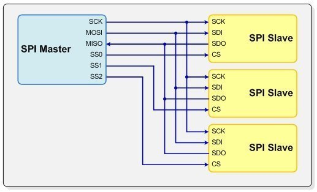
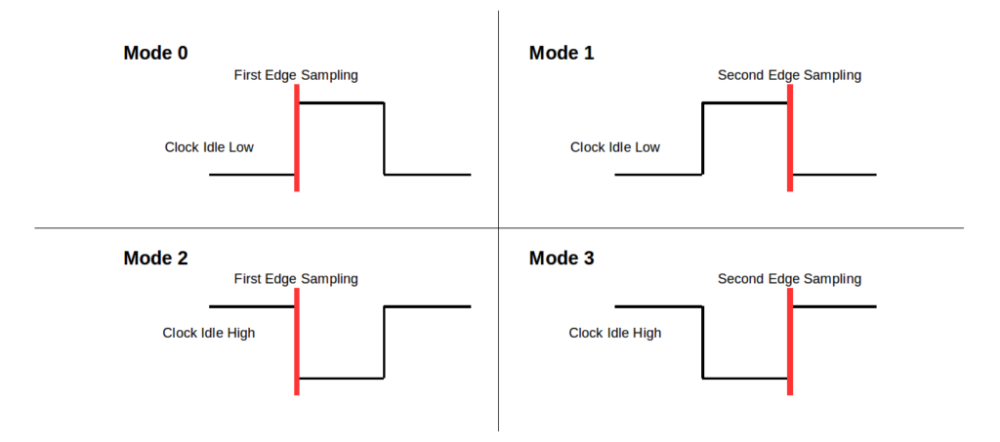

Para o cumprimento das metas da semana, foi feito o seguinte:

- Adicionados makefile e scripts de síntese adaptados do projeto [Vending Machine](https://github.com/VEEETOOORRR/VendingMachine).
- Criados arquivos porta_and.sv e porta_and_tb.sv para verificar funcionamento dos scripts adaptados

# Relatório de estudos

## AES (FIPS-197)

Algoritmo de criptografia simétrica. Permite criptografar/descriptografar dados em blocos de 128 bits, utilizando-se de chaves criptográficas de 128, 192 ou 256 bits. Internamente, realiza uma série de operações sequenciais em rodadas até retornar a informação devidamente critografada/descriptografada. 

OBS: PARA DESCRIPTOGRAFAR, CERTAS OPERAÇÕES SÃO REALIZADAS DE FORMA INVERSA (ORGANIZAR ISSO NO RELATÓRIO)

### Operação interna

AES realiza operações com bytes. Cada bloco de 128 bits processado é organizado em uma matrix 4x4 contendo 16 bytes no total. Cada posição da matriz é chamada de estado.

| B0 | B4 | B8 | B12 |
| B1 | B5 | B9 | B12 |
| B2 | B6 | B10 | B14 |
| B3 | B7 | B11 | B15 |

ORGANIZAR TABELA ACIMA

A quantidade de rodadas para encriptar o bloco depende do tamanho da chave, conforme a tabela abaixo. Para cada rodada, é gerada uma chave de rodada a partir da chave original, em um processo chamado Key Expansion.

| N (Número de rodadas) | Tamanho da chave (em bits) |
| :--- | :--- |
| 10 | 128 |
| 12 | 192 |
| 14 | 256 |

Rodadas 1 a N - 1:
SubBytes -> ShiftRows -> MixColumns -> Add Round Key

Rodadas N:
SubBytes -> ShiftRows -> Add Round Key

SubBytes: Substitui cada byte por outro seguindo uma lookup-table chamada S-box, representada abaixo:

ShiftRows: Desloca cada linha para a esquerda uma certa quantidade de vezes.

L0: Não é deslocada

L1: Deslocada 1 vez

L2: Deslocada 2 vezes

L3: Deslocada 3 vezes

MixColumns: Operação de multiplicação matricial. Cada coluna é multiplicada por uma matriz

## Protocolo SPI

Protocolo síncrono, serial e full-duplex de transmissão de dados. Permite a conexão de vários dispositivos slave ao mesmo master. O dispositivo master é responsável por gerar o sinal de clock (SCK) e por gerenciar com qual dispositivo slave a comunicação ocorrerá em cada instante, através do sinal de seleção chip select/slave select (CS/SS). Normalmente a transmissão de um dado é feita de trás pra frente, com o MSB sendo transmitido primeiro, mas muitas controladoras SPI fornecem a opção de transmitir primeiramente o LSB.

### Barramento de sinais

| Sinal | Direção | Nome Extenso | Descrição |
| :--- | :--- | :--- | :--- |
| **SCK** | Master -> Slave | Serial Clock | Sinal de relógio gerado pelo master para sincronizar a transmissão e amostragem dos bits |
| **CS / SS** | Master -> Slave | Chip Select / Slave Select | Sinal ativo em nível lógico baixo que habilita um slave específico para comunicação |
| **MOSI / SDO** | Master -> Slave | Master Out, Slave In / Serial Data Out | Linha de transmissão de dados do master para o slave |
| **MISO / SDI** | Slave -> Master | Master In, Slave Out / Serial Data In | Linha de transmissão de dados do slave para o master. |

*Figura 1 - Diagrama de conexões entre dispositivos master e múltiplos slaves. Disponível em: [link](https://microcontroller-course.web.cern.ch/Peripherals/SPI.en/)*

Os sinais SCK, MOSI e MISO são comuns a todos os dispositivos do barramento. Cada slave possui seu próprio sinal CS dedicado. Caso o barramento possua N dispositivos slave, o master deverá disponibilizar N pinos de Chip Select.

### Vantagens
- Alta Velocidade: Frequências de clock podem ultrapassar dezenas de MHz (superior ao I2C e UART).
- Comunicação Full-Duplex: Envio e recebimento simultâneo de dados.
- Simplicidade de Hardware: Não exige circuitos complexos de transceptor nem gerenciamento de endereços no pacote.
- Flexibilidade de Dados: Não fica estritamente limitado a quadros de 8 bits (pode-se transferir 12, 16 ou mais bits por ciclo).

### Desvantagens
- Alto Consumo de Pinos: Exige 3 + N pinos de I/O no master para N escravos.
- Sem Confirmação de Recebimento (Ack/Nack): Não há verificação por hardware de que o dado foi entregue com sucesso.

### Modos de configuração SPI

**Modo 0:** 
- SCK em repouso em nível lógico baixo
- Amostragem do bit nas linhas de dados MOSI/MISO em borda de subida do SCK

**Modo 1:**
- SCK em repouso em nível lógico baixo
- Amostragem do bit nas linhas de dados MOSI/MISO em borda de descida do SCK

**Modo 2:**
- SCK em repouso em nível lógico alto
- Amostragem do bit nas linhas de dados MOSI/MISO em borda de subida do SCK

**Modo 3:**
- SCK em repouso em nível lógico alto
- Amostragem do bit nas linhas de dados MOSI/MISO em borda de descida do SCK

*Figura 2 - Representação dos diferentes modos de configuração do SPI. Disponivel em: [link](https://www.mikroe.com/blog/spi-bus)*